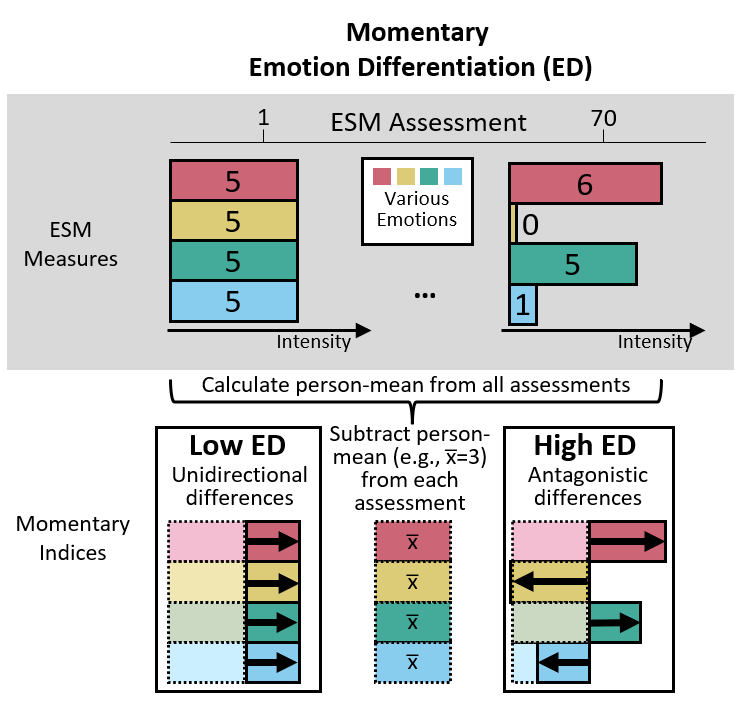

```{r setup, include = FALSE}
library("dplyr")
library("papaja")
library("kableExtra")
library("worcs")
r_refs("r-references.bib")
```

Adolescence[^1] is a period of emotional challenges ranging from pubertal changes, academic or work-related pressure, and transforming interpersonal relationships [@holmbeck2006development]. To successfully navigate this transitional period, adolescents need to develop their emotion regulation skills [@klein2022adolescent]. Difficulty in doing so is a transdiagnostic factor for psychopathology [@sloan2017emotion]. Adaptive emotion regulation may encompass high variability in using emotion regulation strategies to meet environmental demands, indicating that adolescents can flexibly use the right strategies to cope with changing situations [@aldaoEmotionRegulationFlexibility2015]. This emotion regulation variability is expected to be facilitated by emotion differentiation – how well emotions are distinctively labelled – because knowing what one feels informs ways of regulating one’s emotions [@schwarz1983mood; @barrettKnowingWhatYou2001; @berking2014adaptive; @kashdanUnpackingEmotionDifferentiation2015]. Emotion differentiation is increasingly being proposed as an intervention target for improving emotion regulation [@van2019experience; @ye2023negative]. Before it becomes appropriate to target emotion differentiation in interventions, we need to clarify the temporal sequence between emotion differentiation and emotion regulation variability. However, empirically, it is currently unclear whether emotion differentiation precedes emotion regulation variability. This study, therefore, investigates the temporal sequences between adolescents' emotion differentiation and emotion regulation variability in their daily lives. 

[^1]: We followed a recent definition of adolescence as ages 10 to 25 [@sawyer2018age].

## Differentiated emotions may facilitate emotion regulation 

To study the relation between emotion differentiation and emotion regulation in daily life, researchers often assess emotions and emotion regulation strategies repeatedly over the course of several days, for instance using daily diaries or experience sampling methods (ESM). These methods allow researchers to capture life as it is lived with high ecological validity [@bolgerIntensiveLongitudinalMethods2013]. Using these methods, researchers have shown that high emotion differentiation situationally buffers adolescents from depressive feelings [upon perceived stress, @nookHighEmotionDifferentiation2021a; upon rumination, @starrWhenFeelingsLack2017a].

However, empirical evidence on how emotion differentiation is directly related to emotion regulation is weaker. Two studies have investigated this association between individuals. While one daily diary study found that individuals with higher differentiation of negative emotions showed greater average use of emotion regulation strategies compared to those with lower emotion differentiation [@barrettKnowingWhatYou2001], another ESM study that examined separate strategies only found a negative association between negative emotion differentiation and social sharing, but not with the other five strategies examined [@kalokerinosDifferentiateRegulateLow2019]. 

Empirical evidence on within-person associations also do not support a directional relationship between emotion differentiation and emotion regulation. A 10-day ESM study showed that on days when university students had higher negative emotion differentiation than usual, they did not use their emotion regulation strategies any differently [@otooleNegativeEmotionDifferentiation2021a]. To the best of our knowledge, there was only one study that investigated the _temporal precedence_ of emotion differentiation and emotion regulation. This was potentially the case because previous studies calculated emotion differentiation as a summary of multiple assessments within individuals before the first within-person index of emotion differentiation was recently developed [@erbasMomentaryEmotionDifferentiation2021a]. Using this momentary index, a recent ESM study has shown that lower emotion differentiation predicted subsequent higher social sharing, although this association was only seen in two out of four datasets analyzed [@sels2022]. Overall, empirical evidence suggests weak between-person associations between emotion differentiation and the use of emotion regulation strategies, and potentially no concurrent or temporal within-person associations.

## Emotion Regulation Variability: Dynamics of Multiple Strategies

Previous studies have analyzed emotion regulation strategies separately. However, this may miss out the dynamics of how adolescents deploy strategies across time, which is referred to as emotion regulation variability. Emotion regulation variability is comprised of endorsement change (i.e., changes in mean intensity of strategies) and strategy switching (i.e., changes between strategies across time)[@lo2023theory]. As with emotion differentiation, few methods have been available to study within-person emotion regulation variability. Recently, Bray-Curtis dissimilarity, an index commonly used in ecology to quantify changes in biodiversity, has been validated in its detection of within-person emotion regulation variability. This index and its two subcomponents, which reflect endorsement change and strategy switching, were all related to subsequent lower negative emotion intensity [@lo2023theory], supporting the idea that higher emotion regulation variability is adaptive in daily life. 

## The Present Study

Our study examined the temporal relationship between emotion differentiation and emotion regulation variability from early to late adolescence. We pre-registered two within-person temporal hypotheses: In line with the idea that emotion differentiation facilitates emotion regulation, Hypothesis 1 stated that greater emotion differentiation at a given moment is related to higher emotion regulation variability at the subsequent moment. Previous theoretical discussions did not expect a reversed temporal sequence [@kashdanUnpackingEmotionDifferentiation2015; @thompsonGainingClarityEmotion2021]. Therefore, Hypothesis 2 stated that emotion regulation variability at one moment is not associated with emotion differentiation at the following moment. Additionally, we had a between-person hypothesis: Hypothesis 3 stated that adolescents with higher emotion differentiation will show higher emotion regulation variability on average. We tested these hypotheses using data from five ESM studies, in which adolescents rated momentary emotions and emotion regulation strategies multiple times per day. All pre-registered hypotheses concerned the differentiation of _negative_ emotions because previous literature mostly investigated negative emotion differentiation. Due to limited previous research, we explored these hypotheses again with the subcomponents of emotion regulation variability, and with positive emotion differentiation. In all our hypotheses, we focused solely on negative emotion regulation, as there were limited datasets available that measured positive emotion regulation, preventing us from testing similar hypotheses with sufficient statistical power.


<!--The function below inserts a notification if the manuscript is knit using synthetic data. Make sure to insert it after load_data().-->
`r notify_synthetic()`

```{r analysis-preferences}
# Seed for random number generation
set.seed(42)
knitr::opts_chunk$set(cache.extra = knitr::rand_seed)
```


# Method

This paper follows the Workflow for Open Reproducible Code in Science [@vanlissaWORCSWorkflowOpen2021]. The pre-registration (hypotheses and analysis plan), data and analysis codes of this study are available via https://osf.io/cq6n4/?view_only=d0317604686d4ea6b65176672a722a64. In Supplemental Materials 1, we detailed our _a priori_ power analysis which showed we had more than 80% power to test our hypotheses, and reported three minor deviations we had from our pre-registration.

```{r, echo = FALSE}
table1 <- as.data.frame(read.csv("results/Table1.csv"))
# row 1 to 5: datasets 1-5
# row 6: total
```

## Participants and Procedures
This study combines five ESM datasets (see Supplemental Materials 2 for details on participants and procedures). Table 1 shows an overview of the demographics per dataset. The five datasets included participants with a mean age of `r table1[6,"mean_AGE"]` years (_SD_ = `r table1[6,"SD_AGE"]`; range: `r table1[6,"lrange_AGE"]` to `r table1[6,"urange_AGE"]` years), with `r table1[6,"mean_FEMALE"]*100`% females (range across datasets: `r min(table1[1:5,"mean_FEMALE"]*100)`% to `r max(table1[1:5,"mean_FEMALE"]*100)`%). All studies, approved by respective ethical committees, were conducted in Belgium and the Netherlands with Dutch-speaking participants. All studies assessed participants either 10 times for 7 days or 5 times for 14 days, resulting in the same 70 observations. As pre-registered, we excluded 33 participants with zero variance in positive emotions, negative emotions or emotion regulation strategies. We further excluded 4 participants with an average reaction time below 500ms because it may indicate careless responding [@mccabeGuideDataCleaning2012]. Participants completed on average `r round(table1[6,"mean_t"]*100,0)`% of all possible observations (_SD_ = `r round(table1[6,"SD_t"]*100,0)`%). Supplemental Materials 2 has further details on participants and procedures of all datasets. 


```{r, echo = FALSE, warning=FALSE}
# there was a "warning in stri_detect_regex" which did not affect table 1 output
# so we suppress warning here
table1 <- as.data.frame(read.csv("results/Table1.csv"))[1:5,]
row.names(table1) <- c("G(F)ood together (Verhagen et al., 2022)",
                             "Emotions in daily life 2011 (Koval et al., 2013)",
                             "3-wave longitudinal study (Erbas et al., 2018)",
                             "Emotions in daily life (van Roekel \\& Trompetter, 2023)",
                             "Outside-in (Braet et al., 2023)"
                             )
table1$Institute <- c("Radboud University, the Netherlands",
                      "KU Leuven, Belgium",
                      "KU Leuven, Belgium",
                      "Tilburg University, the Netherlands",
                      "Ghent University, Belgium")
table1$AGEcombine <- paste0(round(table1$mean_AGE,1), " (",
                            round(table1$SD_AGE,1), "),\n",
                            round(table1$lrange_AGE,1),".0 — ",
                            round(table1$urange_AGE,1),".0")
table1$AGEcombine <- linebreak(table1$AGEcombine)
table1$Female <- paste0(round(table1$mean_FEMALE*100,0),"\\%")
table1$ObsPerDay <- c(10,10,10,5,5)
table1$NumDay <- c(7,7,7,14,14)
table1$Interval <- c("Semi-random",
                     "Stratified-random",
                     "Stratified-random",
                     "Quasi-random",
                     "Fixed")
table1$PA <- c("4 items:\nContent\nRelaxed\nJoyful\nEnergetic",
               "2 items:\nRelaxed\nHappy",
                "3 items:\nHappy\nRelaxed\nCheerful",
                "7 items:\nEnthusiastic\nContent\nEnergetic\nCalm\nDeteremined\nCheerful\nGrateful",
                "3 items:\nHappy\nCalm\nEnthusiastic")
table1$NAE <- c("5 items:\nIrritated\nWorried\nDepressed\nInsecure\nLonely",
                "4 items:\nAngry\nAnxious\nDepressed\nSad",
                "6 items:\nAngry\nAnxious\nDepressed\nSad\nLonely\nStress",
                "6 items:\nAngry\nIrritated\nDepressed \nSad\nNervous\nBored",
                "6 items:\nAngry\nInsecure\nAfraid\nSad\nStressed\nBored")
table1$ER <- c("5 items:\nRumination\nReappraisal\nSuppression\nAcceptance\nSocial Sharing",
                "6 items:\nRumination\nReappraisal\nDistraction \nReflection\nSuppression\nSocial Sharing",
                "6 items:\nRumination\nReappraisal\nDistraction\nWorry\nSuppression\nSocial Sharing",
                "7 items:\nRumination\nDistraction\nAvoidance\nProblem Solving\nAcceptance\nCo-Brooding\nSocial Sharing",
                "8 items:\nRumination\nReappraisal\nDistraction\nSelf-Compassion (Support)\nSelf-compassion (Cheer-up)\nExpression\nSuppression\nSocial Sharing")

table1$PA <- linebreak(table1$PA)
table1$NAE <- linebreak(table1$NAE)
table1$ER <- linebreak(table1$ER)


table1 <- table1[, c("Institute", "N", "AGEcombine",
                     "Female","ObsPerDay","NumDay","Interval","PA","NAE","ER")]
table1 <- as.data.frame(t(table1))
row.names(table1) <- c("Institute",
                       "N after exclusion criteria applied",
                       "Age M (SD), range",
                       "Female",
                       "Observations per day",
                       "Number of days",
                       "Interval scheme",
                       "Positive emotions",
                       "Negative emotions",
                       "Emotion regulation strategies")
            
kbl(table1,
    booktabs = T, align = "l", linesep = '',
    escape = FALSE,
    caption = "Overview of Study Characteristics of Included Datasets")  %>%
    column_spec(1, bold = TRUE, width = "1in") %>%
    column_spec(2:6, width = "1in") %>%
    row_spec(0, bold = TRUE) %>%
    kable_styling(font_size = 7)
```

```{r, echo = FALSE}
ESMICC <- as.data.frame(read.csv("results/ESMmeasuresICC.csv"))
minICC <- min(ESMICC$ICC)
maxICC <- max(ESMICC$ICC)
```


## Measures

### ESM Measures

The studies differed in how many items were used to assess negative emotions, positive emotions, and emotion regulation strategies, but they all used multiple items with unipolar scales (see Table 1). Within each dataset, all items were rescaled before analyses to a scale of 0 to 10 to facilitate pooling across studies. Within-person correlations of items in the same scales were all lower than .80 (Supplemental Materials 3), indicating no multicollinearity problem [@katz2006study; see application to an ESM study, @wang2024reciprocal]. Intraclass correlation coefficients (ICC) of all items ranged from `r printnum(minICC, gt1=FALSE)` to `r printnum(maxICC, gt1=FALSE)`, indicating they had adequate within-person variance for further analyses. Supplemental Materials 2 has full item wordings for all items and the steps we have taken to assess their reliability and validity.


```{r, echo = FALSE}
ESMreliability <- as.data.frame(read.csv("results/outputReliability.csv", na.strings="XXX"))
# one of the var name is "NA" so we deactivate treating string "NA" as missing (value NA in R)
```


### Momentary Indices Calculated from ESM Measures

#### Intensity of Positive Emotions, Negative Emotions, and Emotion Regulation

We calculated momentary intensities of negative emotions, positive emotions, and emotion regulation as the mean intensities of relevant items (e.g., in dataset 2, momentary negative emotion intensity is the mean of _angry_, _sad_, _anxious_, and _depressed_). Multi-level confirmatory factor analyses using the _lavaan_ package [@rosseelLavaanPackageStructural2012a] showed positive and negative emotions loaded separately on two factors as indicated with satisfactory fit indices (Supplemental Materials 4). Reliability was satisfactory for all indices within adolescents (positive emotion intensity: `r printnum(ESMreliability%>%filter(var=="PA")%>%filter(label=="omega_within")%>%select(est)%>%min, , gt1=FALSE)` to `r printnum(ESMreliability%>%filter(var=="PA")%>%filter(label=="omega_within")%>%select(est)%>%max, , gt1=FALSE)`; negative emotion intensity: `r printnum(ESMreliability%>%filter(var=="NA")%>%filter(label=="omega_within")%>%select(est)%>%min, , gt1=FALSE)` to `r printnum(ESMreliability%>%filter(var=="NA")%>%filter(label=="omega_within")%>%select(est)%>%max, , gt1=FALSE)`; emotion regulation intensity: `r printnum(ESMreliability%>%filter(var=="ER")%>%filter(label=="omega_within")%>%select(est)%>%min, , gt1=FALSE)` to `r printnum(ESMreliability%>%filter(var=="ER")%>%filter(label=="omega_within")%>%select(est)%>%max, , gt1=FALSE)`) and between adolescents (positive emotion intensity: `r printnum(ESMreliability%>%filter(var=="PA")%>%filter(label=="omega_between")%>%select(est)%>%min, , gt1=FALSE)` to `r printnum(ESMreliability%>%filter(var=="PA")%>%filter(label=="omega_between")%>%select(est)%>%max, , gt1=FALSE)`; negative emotion intensity: `r printnum(ESMreliability%>%filter(var=="NA")%>%filter(label=="omega_between")%>%select(est)%>%min, , gt1=FALSE)` to `r printnum(ESMreliability%>%filter(var=="NA")%>%filter(label=="omega_between")%>%select(est)%>%max, , gt1=FALSE)`; emotion regulation intensity: `r printnum(ESMreliability%>%filter(var=="ER")%>%filter(label=="omega_between")%>%select(est)%>%min, , gt1=FALSE)` to `r printnum(ESMreliability%>%filter(var=="ER")%>%filter(label=="omega_between")%>%select(est)%>%max, , gt1=FALSE)`).

#### Emotion differentiation 

To assess the degree of positive and negative emotion differentiation within adolescents at a specific moment, we calculated the momentary emotion differentiation index from the positive and negative emotion items [@erbasMomentaryEmotionDifferentiation2021a]. This index was mathematically derived from the average consistency variant of ICC, a between-person measure of emotion differentiation commonly used in prior research to assess emotion differentiation. This index has no lower bound and an upper bound of 0 and it shows good predictive validity [@erbasMomentaryEmotionDifferentiation2021a]. The momentary emotion differentiation index measures how consistently intensities of emotions are deviating in the same direction (i.e., positively or negatively) with regard to a person’s mean. For example, if an adolescent has a mean rating of 3 in each of the four emotions assessed 70 times, a moment when all four emotions are rated at 5 will give a low value of momentary emotion differentiation, whereas a moment when two of the four emotions are rated higher (e.g., 6 and 5) and two lower (e.g., 0 and 1) will give a high value of momentary emotion differentiation (Figure 1). 

(ref:figure1-caption) Hypothetical assessments of ESM measures to illustrate how to calculate emotion differentiation. For simplicity, only the calculation steps of the numerator but not the denominator are shown. Numbers on the bars represent the intensity ratings of emotions.

```{r figure1, out.width="100%", fig.cap = "(ref:figure1-caption)"}

```


#### Emotion regulation variability

We calculated momentary emotion regulation variability as Bray-Curtis dissimilarity from the emotion regulation strategy items. This index has recently been validated [@lo2023theory]. This momentary index can be partitioned into two subcomponents that respectively detect two qualitatively different and theoretically relevant subcomponents [@aldaoEmotionRegulationFlexibility2015]: endorsement change (e.g., from not using any strategies to using distraction) and strategy switching (e.g., replacing distraction with reappraisal). Bray-Curtis dissimilarity was calculated by comparing the moment of interest with all other moments the same adolescent reported (Figure 2) using the _betapart_ package [@baselgaBetapartPartitioningBeta2022; see Github tutorial at @Lo_Bray-Curtis_dissimilarity_for_2023]. In this way, Bray-Curtis dissimilarity reflects the within-person deviation from their typical emotion regulation style - in terms of intensity or strategy selection[^2]. Before calculating Bray-Curtis dissimilarity, we linearly transformed all emotion regulation intensity ratings by adding a small constant 0.001 to prevent division-by-zero computational errors, so that two moments with all strategies rated 0 can still be compared. Bray-Curtis dissimilarity index falls between 0 and 1. To improve comparison with other indices, we multiplied the Bray-Curtis dissimilarity index with 10 so it ranges from 0 to 10, where 0 indicates no variability and 10 represents the maximum variability possible, based on the emotion regulation intensity it is derived from.

[^2]: Another method to compute Bray-Curtis dissimilarity is by contrasting each moment with the preceding one. To check the robustness of our results, we ran sensitivity analyses with this successive temporal comparison approach. Results were generally consistent with what we present in the main text. Details can be found in Supplemental Materials 6.

(ref:figure2-caption) Hypothetical assessments of ESM measures to illustrate how to calculate emotion regulation variability. For simplicity, only the calculation steps of the numerator but not the denominator are shown.

```{r figure2, out.width="100%", fig.cap = "(ref:figure2-caption)"}
knitr::include_graphics("Figure2.png")
```


## Analysis

We conducted all analyses in this paper in R [@rcoreteamLanguageEnvironmentStatistical2023]. After preparing each dataset, data were pooled into an overall dataset for analysis. To distinguish temporal effects (Hypothesis 1 & 2) from individual differences (Hypothesis 3), we separated observations of indices (negative emotion intensity, negative emotion differentiation, emotion regulation variability) into two components. The within-person component, which can vary at each time point, is the raw score minus the person-mean. The between-person component, which indicate an adolescent’s time-invariant difference from others, is the person-mean minus the grand-mean [@bolgerIntensiveLongitudinalMethods2013]. 

### Confirmatory Models

To test our hypotheses, we ran multilevel models. In model 1A, which corresponded to Hypothesis 1, emotion differentiation was the predictor and emotion regulation variability was the outcome. In model 2A, which corresponded with Hypothesis 2, emotion regulation variability was the predictor and emotion differentiation was the outcome. In the two multilevel models, observations (Level 1) were nested within participants (Level 2). Participants (Level 2) were further nested within datasets (Level 3) to account for between-dataset differences [see @boedhoe2019empirical for related methodological discussion]. The outcome variables at each moment were predicted by the within-person components at Level 1 and within-person components at Level 2. We added momentary negative emotion intensity and momentary emotion regulation as covariates, because we wanted to examine the relations between predictor and outcome variables above and beyond mean intensities [@otooleNegativeEmotionDifferentiation2021a; @dejonckheereComplexAffectDynamics2019]. We added time as a covariate, centered with the 35.5th observation as zero, to control for any systematic time trends in the data. Age and gender were also added as time-invariant covariates. Time-varying within-person components of the predictor and control variables were entered as both fixed and random effects. Random intercepts and slopes were allowed to covary. Within-person components and centered time were entered as fixed effects. We included a first-order autocorrelation structure on the residuals. We used the _nlme_ package [@pinheiroNlmeLinearNonlinear2022] to estimate multilevel models with the quasi-Newton optimizer. To test the hypotheses, we were primarily interested in whether the fixed effects differed significantly from zero, as indicated by a 95% confidence interval. Hypotheses 1 (emotion differentiation predicting subsequent emotion regulation variability) and 2 (emotion regulation variability not predicting subsequent emotion differentiation) were tested by examining the significance of the fixed effects of the within-person components of the predictor variables in models 1A and 2A. Hypothesis 3 (emotion differentiation being positively associated with emotion regulation variability between adolescents), was tested by examining the significance of the fixed effect of within-person components in model 2A[^3]. 

[^3]: Model 2A was selected over model 1A for testing to allow easier comparison of  estimates with our exploratory findings from model 2B. For exploratory analyses, we selected model 2B to simultaneously assess both subcomponents on one side as predictors, unlike models 1B and 1C which split them as outcomes and predictors.

### Exploratory Models

We had two sets of exploratory analyses. First, to delineate how emotion differentiation is associated with strategy switching and endorsement change, we ran exploratory models 1B, 1C, and 2B. Model 1B and 1C followed the structure of model 1A, treating emotion differentiation as the predictor, but differed as follows: Model 1B made strategy switching the outcome and added endorsement change as a covariate; model 1C made endorsement change the outcome and added strategy switching as a covariate. Model 2B followed the structure of model 2A, treating emotion differentiation as the outcome but used both emotion regulation variability subcomponents (strategy switching and endorsement change) as simultaneous predictors in replacement of the full index in model 2A. Second, we also tested for the associations between positive emotion differentiation and emotion regulation of negative emotions. For this, we repeated all the analyses (model 1A to 2B) by substituting negative emotion indices (differentiation and intensity) with positive emotion indices.

### Frame of Reference

In all datasets, the frame of reference for rating emotion regulation strategies was about regulating the negative emotions between the previous and current assessment (e.g., “Since the last beep, to change my negative feelings, I have sought for distraction”), whereas emotion items were assessed in terms of “right now” during each assessment (Figure 3). Therefore, associations between momentary emotion regulation variability and emotion differentiation index derived from the same assessment indicate emotion regulation variability precedes emotion differentiation. As such, to examine Hypothesis 1 (i.e., emotion differentiation facilitating subsequent emotion regulation variability; model 1A to 1C), we used the lagged momentary emotion differentiation index as the predictor (and lagged momentary negative emotion intensity as covariate), and momentary emotion regulation variability as the outcome. In contrast, to examine Hypothesis 2 (i.e., emotion regulation variability does not affect subsequent emotion differentiation; model 2A and 2B), momentary emotion regulation variability as the predictor and the momentary emotion differentiation index as the outcome both came from the same assessment.

(ref:figure3-caption) t refers to the moment of interest. Tiles with similar colours and borders belong to the same moment.

```{r figure3, out.width="100%", fig.cap = "(ref:figure3-caption)"}

```


# Results

## Descriptive Statistics

On average, adolescents showed relatively low intensity of negative emotions and emotion regulation but moderate positive emotion intensity (Table 2). With regards to emotion differentiation and emotion regulation variability indices, within-person and between-person variance indicates that there is sufficient variation across time and between people. In Supplemental Materials 3, we detailed how we inspected the indices' distributions, assessed potential floor and ceiling effects, and compared correlations of momentary indices against published studies. In general, we considered it appropriate to further analyze emotion differentiation and emotion regulation variability indices as the primary (in)dependent variables in our hypotheses.


```{r, echo = FALSE}
# table2 <- as.data.frame(read.csv("results/Table2.csv"))[,c(1,3:7)]
table2 <- cbind(as.data.frame(read.csv("results/Table2.csv"))[,c(1)],
                data.frame(tmin = c(" 0.00","-Infinity"," 0.00","-Infinity",
                                    rep(" 0.00",4)),
                              tmax = c(rep(c("10.00"," 0.00"),2),
                                       rep("10.00",4))),
                as.data.frame(read.csv("results/Table2.csv"))[,c(3:7)])
row.names(table2) <- NULL
colnames(table2)[1] <- "var"
table2$var <- c("Positive emotion intensity",
                             "Positive emotion differentiation",
                             "Negative emotion intensity",
                             "Negative emotion differentiation",
                             "Emotion regulation intensity",
                       "Emotion regulation variability (full index)",
                       "  Endorsement change subcomponent",
                       "  Strategy switching subcomponent"
                             )
colnames(table2) <- c("Momentary index",
                      "Minimum Possible Value",
                      "Maximum Possible Value",
                      "Mean",
                      "Between-person SD",
                      "Within-person SD",
                      "Within-person Minimum",
                      "Within-person Maximum")
outTable2 <- apa_table(table2, 
          # langscape = TRUE,
          caption = "Descriptive Statistics of Momentary Indices of the Pooled Dataset (N=778)",
          escape = FALSE
          # , format = "html"
          # align = c("m{8cm}", rep("m{2cm}", 5))
          )
# outTable1[1] <- gsub("XXnewlineXX", "<br>", outTable1[1])
# outTable2
kbl(table2,
    booktabs = T, align = "l", linesep = '',
    escape = FALSE,
    caption = "Descriptive Statistics of Momentary Indices of the Pooled Dataset (N=778)")  %>%
    column_spec(1, width = "1.4in") %>%
    column_spec(2:8, width = "0.65in") %>%
    kable_styling(font_size = 9)

```


## Confirmatory Analyses

In contrast with Hypothesis 1, model 1A (Table 3) results showed negative within-person associations between negative emotion differentiation and subsequent emotion regulation variability. This indicates that higher negative emotion differentiation at one moment was related to lower emotion regulation variability within adolescents at the subsequent moment. 
In contrast with Hypothesis 2, model 2A indicated that higher emotion regulation variability at one moment was significantly associated with decreases in negative emotion differentiation at the subsequent moment. 

In contrast with Hypothesis 3, results revealed no within-person association between negative emotion differentiation and emotion regulation variability (model 2A, Table 3). These results suggest the average level of emotion differentiation and emotion regulation variability of adolescents were not related. 

To summarize, none of the three hypotheses were supported. In terms of within-person temporal relations, emotion differentiation and emotion regulation variability seem to hinder each other subsequently. In terms of individual differences, there was no relationship between emotion differentiation and emotion regulation variability. 


```{r, echo = FALSE}
SMTable5 <- as.data.frame(read.csv("results/SMTable5.csv"))
SMTable5$estimates <- paste0(sprintf("%.3f",SMTable5$FEest)," [",
                             sprintf("%.3f",SMTable5$l95CI),", ",
                             sprintf("%.3f",SMTable5$u95CI),"]")
iNmodel1 <- min(SMTable5[grep("1",SMTable5$model),"N"])
itmodel1 <- min(SMTable5[grep("1",SMTable5$model),"nobs"])
iNmodel2 <- min(SMTable5[grep("2",SMTable5$model),"N"])
itmodel2 <- min(SMTable5[grep("2",SMTable5$model),"nobs"])


table3 <- data.frame(Hypothesis = 1:9)
table3$Hypothesis <- c("Emotion differentiation → Emotion regulation variability",
                      "Emotion differentiation → Strategy switching",
                      "Emotion differentiation → Endorsement change",
                      "Emotion regulation variability → Emotion differentiation",
                      "Strategy switching → Emotion differentiation",
                      "Endorsement change → Emotion differentiation",
                      "Emotion differentiation←→Emotion regulation variability", # sadly, some unicodes can't be shown, e.g., \\char\"2190
                      "Emotion differentiation←→rategy switching",
                      "Emotion differentiation←→Endorsement change")
table3$Negative <- c(
                     SMTable5[intersect(grep("1A_NA",SMTable5$model), grep("m_EDcwL1D",SMTable5$X)),"estimates"],
                     SMTable5[intersect(grep("1B_NA",SMTable5$model), grep("m_EDcwL1D",SMTable5$X)),"estimates"],
                     SMTable5[intersect(grep("1C_NA",SMTable5$model), grep("m_EDcwL1D",SMTable5$X)),"estimates"],
                     SMTable5[intersect(grep("2A_NA",SMTable5$model), grep("BrayCurtisFull.ammcw",SMTable5$X)),"estimates"],
                     SMTable5[intersect(grep("2B_NA",SMTable5$model), grep("BrayCurtisRepl.ammcw",SMTable5$X)),"estimates"],
                     SMTable5[intersect(grep("2B_NA",SMTable5$model), grep("BrayCurtisNest.ammcw",SMTable5$X)),"estimates"],
                     SMTable5[intersect(grep("2A_NA",SMTable5$model), grep("BrayCurtisFull.ammcb",SMTable5$X)),"estimates"],
                     SMTable5[intersect(grep("2B_NA",SMTable5$model), grep("BrayCurtisRepl.ammcb",SMTable5$X)),"estimates"],
                     SMTable5[intersect(grep("2B_NA",SMTable5$model), grep("BrayCurtisNest.ammcb",SMTable5$X)),"estimates"]
)
table3$Positive <- c(SMTable5[intersect(grep("1A_PA",SMTable5$model), grep("m_EDPAcwL1D",SMTable5$X)),"estimates"],
                     SMTable5[intersect(grep("1B_PA",SMTable5$model), grep("m_EDPAcwL1D",SMTable5$X)),"estimates"],
                     SMTable5[intersect(grep("1C_PA",SMTable5$model), grep("m_EDPAcwL1D",SMTable5$X)),"estimates"],
                     SMTable5[intersect(grep("2A_PA",SMTable5$model), grep("BrayCurtisFull.ammcw",SMTable5$X)),"estimates"],
                     SMTable5[intersect(grep("2B_PA",SMTable5$model), grep("BrayCurtisRepl.ammcw",SMTable5$X)),"estimates"],
                     SMTable5[intersect(grep("2B_PA",SMTable5$model), grep("BrayCurtisNest.ammcw",SMTable5$X)),"estimates"],
                     SMTable5[intersect(grep("2A_PA",SMTable5$model), grep("BrayCurtisFull.ammcb",SMTable5$X)),"estimates"],
                     SMTable5[intersect(grep("2B_PA",SMTable5$model), grep("BrayCurtisRepl.ammcb",SMTable5$X)),"estimates"],
                     SMTable5[intersect(grep("2B_PA",SMTable5$model), grep("BrayCurtisNest.ammcb",SMTable5$X)),"estimates"]
)
table3$Model <- c("1A",
                  "1B",
                  "1C",
                  "2A",
                  "2B",
                  "2B",
                  "2A",
                  "2B",
                  "2B"
)
table3$pNA <-  c(
  SMTable5[intersect(grep("1A_NA",SMTable5$model), grep("m_EDcwL1D",SMTable5$X)),"pvalue"],
  SMTable5[intersect(grep("1B_NA",SMTable5$model), grep("m_EDcwL1D",SMTable5$X)),"pvalue"],
  SMTable5[intersect(grep("1C_NA",SMTable5$model), grep("m_EDcwL1D",SMTable5$X)),"pvalue"],
  SMTable5[intersect(grep("2A_NA",SMTable5$model), grep("BrayCurtisFull.ammcw",SMTable5$X)),"pvalue"],
  SMTable5[intersect(grep("2B_NA",SMTable5$model), grep("BrayCurtisRepl.ammcw",SMTable5$X)),"pvalue"],
  SMTable5[intersect(grep("2B_NA",SMTable5$model), grep("BrayCurtisNest.ammcw",SMTable5$X)),"pvalue"],
  SMTable5[intersect(grep("2A_NA",SMTable5$model), grep("BrayCurtisFull.ammcb",SMTable5$X)),"pvalue"],
  SMTable5[intersect(grep("2B_NA",SMTable5$model), grep("BrayCurtisRepl.ammcb",SMTable5$X)),"pvalue"],
  SMTable5[intersect(grep("2B_NA",SMTable5$model), grep("BrayCurtisNest.ammcb",SMTable5$X)),"pvalue"]
)

# table3$Negative <- cell_spec(table3$Negative, 
#                              bold = ifelse(table3$pNA < 0.05, TRUE, FALSE))
# table3$Positive <- cell_spec(table3$Positive, 
#                              bold = ifelse(table3$pPA < 0.05, TRUE, FALSE))

table3$pPA <- c(SMTable5[intersect(grep("1A_PA",SMTable5$model), grep("m_EDPAcwL1D",SMTable5$X)),"pvalue"],
                     SMTable5[intersect(grep("1B_PA",SMTable5$model), grep("m_EDPAcwL1D",SMTable5$X)),"pvalue"],
                     SMTable5[intersect(grep("1C_PA",SMTable5$model), grep("m_EDPAcwL1D",SMTable5$X)),"pvalue"],
                     SMTable5[intersect(grep("2A_PA",SMTable5$model), grep("BrayCurtisFull.ammcw",SMTable5$X)),"pvalue"],
                     SMTable5[intersect(grep("2B_PA",SMTable5$model), grep("BrayCurtisRepl.ammcw",SMTable5$X)),"pvalue"],
                     SMTable5[intersect(grep("2B_PA",SMTable5$model), grep("BrayCurtisNest.ammcw",SMTable5$X)),"pvalue"],
                     SMTable5[intersect(grep("2A_PA",SMTable5$model), grep("BrayCurtisFull.ammcb",SMTable5$X)),"pvalue"],
                     SMTable5[intersect(grep("2B_PA",SMTable5$model), grep("BrayCurtisRepl.ammcb",SMTable5$X)),"pvalue"],
                     SMTable5[intersect(grep("2B_PA",SMTable5$model), grep("BrayCurtisNest.ammcb",SMTable5$X)),"pvalue"]
)
txtsplitNA <- strsplit(paste0(
  "Negative Emotions b [95% CI]"), " ")[[1]]
txtsplitPA <- strsplit(paste0(
  "Positive Emotions b [95% CI]"), " ")[[1]]
txtNA <- paste(
  text_spec(txtsplitNA, italic = c(FALSE,FALSE,TRUE,TRUE,TRUE)),
  collapse = " ")
txtPA <- paste(
  text_spec(txtsplitPA, italic = c(FALSE,FALSE,TRUE,TRUE,TRUE)),
  collapse = " ")

boldNA <- ifelse(table3$pNA < 0.05, TRUE, FALSE)
boldPA <- ifelse(table3$pPA < 0.05, TRUE, FALSE)
colnames(table3) <- c("",
                      txtNA,
                      txtPA,
                      "Model")

kbl(table3[,1:4],
    booktabs = T, align = rep("l",4), linesep = '',
    escape = FALSE,
    caption = "Fixed Effect Estimates in Within-person Temporal Associations and Between-person Differences Between Emotion Differentiation and Emotion Regulation Variability",) %>%
      column_spec(1, width = "8cm") %>%
      column_spec(2, width = "3cm", bold = boldNA) %>%
      column_spec(3, width = "3cm", bold = boldPA) %>%
      column_spec(4, width = "1cm")%>%
    kable_styling(font_size = 7, position = "left")%>%
    pack_rows("Within-person temporal hypotheses", 1, 6, bold = FALSE) %>%
    pack_rows(paste0("H1: Higher emotion differentiation is associated with subs equently higher emotion regulation variability (N = ",iNmodel1,", n = ",itmodel1,")"), 1, 3, bold = FALSE) %>%
    pack_rows(paste0("H2: Emotion regulation variability is not associated  with subsequent changes in emotion differentiation (N = ",iNmodel2,", n = ",itmodel2,")"), 4, 6, bold = FALSE) %>%
    pack_rows("Between-person hypothesis", 7, 9, bold = FALSE) %>%
    pack_rows(paste0("H3: Higher emotion differentiation is associated with higher emotion regulation variability (N= ",iNmodel2,")"), 7, 9, bold = FALSE)%>%
footnote(general = "Significant effects are displayed in bold. →: temporal precedence; ←→: between-person association; n: number of ESM assessments with complete observations of all indices required for modeling; N: number of adolescents; b: unstandardized effect; CI: confidence interval; H1 – H3: Hypotheses 1 to 3. Negative emotions and positive emotions were analyzed in separate models. Small differences in n and N between models exist due to different availability of indices as required in the different models. For brevity, we displayed the smaller n and N of the models grouped under the same hypotheses. H1 was tested using three negative emotion models and three positive emotion models because of three outcome variables (emotion regulation variability and its two subcomponents). H2 was tested using two models for positive emotions and two models for negative emotions. Two subcomponents were included together in model 2B  . Full model results with estimates of covariates (emotion intensity, emotion regulation intensity, time, gender, and age) are available in Supplemental Materials 5.",
threeparttable = TRUE
)


    # collapse_rows(1:2, row_group_label_position = 'stack')

# apa_table(table3)
```

## Exploratory Analyses 

### Associations Between Negative Emotion Differentiation and Subcomponents of Emotion Regulation Variability (Strategy Switching and Endorsement Change)

Model 1B and 1C respectively showed that higher negative emotion differentiation was associated with lower subsequent strategy switching and endorsement change. Results indicated that the better adolescents differentiate their emotions at one moment, the less they subsequently deviate from their usual emotion regulation tendency – both in terms of intensity and strategy selection. Model 2B showed that decreases in negative emotion differentiation were also driven by both endorsement change and strategy switching. Results indicated that the more adolescents deviated from their usual tendency in emotion regulation, either in terms of endorsement change or strategy switching, the worse they subsequently differentiated their emotions. 

Between adolescents, only endorsement change in emotion regulation was negatively associated with emotion differentiation, whereas strategy switching was not significantly related with negative emotion differentiation. In other words, adolescents with better emotion differentiation tend to exhibit greater stability in deploying emotion regulation strategies compared to those with lower emotion differentiation, but they do not differ significantly in their propensity to switch between strategies. 

### Associations Between Positive Emotion Differentiation and Emotion Regulation Variability

Our exploratory analyses showed that temporal relations between emotion regulation variability and differentiation of positive emotions were largely similar as that with negative emotions (see Table 3). The negative reciprocal temporal relations hold for the full index as well as for the subcomponents of emotion regulation variability. In other words, the better adolescents differentiated their positive emotions at one moment, the less they subsequently deviated from their usual emotion regulation style. Reciprocally, the more adolescents deviated from their usual tendency in emotion regulation, either in terms of endorsement change or strategy switching, the worse they subsequently differentiated their positive emotions. No within-person associations were found between positive emotion differentiation and emotion regulation variability. 


# Discussion

Using five ESM datasets that encompassed 25,834 observations in 750 adolescents, we tested whether higher emotion differentiation was related to higher subsequent emotion regulation variability. Contrary to our expectations, we discovered that when adolescents had better differentiation between their positive or negative emotions at a given moment, they tended to be more stable in their use of emotion regulation strategies subsequently (i.e., lower emotion regulation variability). Reciprocally, the more adolescents deviated from their typical emotion regulation strategies (i.e., the higher their emotion regulation variability), the less they differentiated their emotions at the next moment. These negative bidirectional temporal influences were robust: They were present independently in two emotion regulation variability subcomponents (endorsement change and strategy switching), and regardless of whether emotion differentiation was operationalized with positive or negative emotions. Overall, those results do not support the hypothesis that emotion differentiation facilitates subsequent emotion regulation variability on a momentary level in adolescents.

## Possible Explanations of the Interplay between Emotion Differentiation and Emotion Regulation Variability

There are several possible mechanisms that could explain negative associations between emotion differentiation and emotion regulation variability. A first explanation is that emotion differentiation could directly dampen emotional intensity, which may lower adolescents' needs to regulate their emotions or change their emotion regulation strategies, resulting in lower variability. Supporting the potential direct effect within adolescents, an ESM study indicated that higher negative emotion differentiation is concurrently associated with lower negative emotion intensity [@erbasMomentaryEmotionDifferentiation2021a]. Furthermore, four experimental studies demonstrated that labeling and distinguishing emotions can lower both positive and negative emotions [@liebermanSubjectiveResponsesEmotional2011]. Alternatively, emotion differentiation may have amplified the dampening effect on emotion intensity of emotion regulation strategies. Indeed, ESM research shows that individuals with higher negative emotion differentiation could dampen negative emotions with a lesser extent of strategy deployment, unlike those with lower differentiation [@kalokerinosDifferentiateRegulateLow2019].  

The second explanation is that emotion differentiation and emotion regulation variability may compete for similar resources outside the emotion system, so that when one process is more active, the other is less so. For example, @lewczuk2022emotion suggested that emotion regulation requires effort and leads to fatigue. If differentiating emotions similarly requires effort, heightened emotion differentiation might limit how much emotion regulation strategies can vary, and vice versa. This resource competition seems to apply regardless of types of emotion (positive or negative) and regulation variability (endorsement change or strategy switching), as indicated by the consistent negative temporal relations in our various models. Overall, future studies should test the possibile mechanisms in the negative reciprocal relationship between these two processes. 


## Open questions in emotion regulation variability

As research on emotion regulation variability in daily life is still in its infancy, several open questions linger about emotion regulation variability. Developmentally, middle adolescents are less likely to regulate their sadness and anger than younger and older adolescents [@zimmermannEmotionRegulationEarly2014b]. If they use strategies  around the lower bounds of ESM measures, it is easier to have all-or-nothing changes resulting in high emotion regulation variability. Relatedly, as adolescents develop their repertoire of regulation strategies, they may exhibit higher emotion regulation variability as they experiment with the new strategies [@elkjaerEmotionRegulationPatterns2022]. Future studies should investigate the developmental trajectory of emotion regulation variability.

Furthermore, emotion regulation variability and its subcomponents may exhibit complex relations with other emotion characteristics. For instance, a recent study showed that when emotions are either less intense or more intense than usual, emotion regulation variability is highest [@maciejewskiEmoCharacteristics]. This suggests that there may be an optimal level of when and how to vary emotion regulation. 

Outside of the emotion regulation system, it is also theorized that (changes in) context is related to emotion regulation variability. For example, adolescents may have limited choices of emotion regulation strategies while they are commuting to school but are more likely to adjust their strategies upon changes of context (e.g., arriving home from school). Varying strategies in synchrony with changing contexts is different from context-insensitive fluctuations [flexibility and instability, @kalokerinosEmotionRegulationFlexibility2022]. Further research that shows how developmental factors, emotion characteristics, and daily life contexts influence emotion regulation variability and its subcomponents may ultimately enrich our understanding of the interplay between emotion differentiation and emotion regulation variability.

## Limitations

A few limitations must be considered when interpreting our results. First, there is heterogeneity across datasets due to varying sample characteristics and ESM protocols. We have included dataset-level random intercepts to mitigate this, but future studies should explore how these study characteristics affect outcomes. 
Second, emotional processes develop across the age range we studied [@yurgelun2007emotional; @casey2019development]. We have controlled for age in our main analyses, but differences in study designs between datasets prevented us from systematically testing age differences. Therefore, we cannot rule out the possibility that different underlying processes are in play across age. Ideally, future research could make use of one large dataset that covers the whole adolescent age range to test age differences.
Third, the generalizability of our conclusions depends on the scope of emotion and emotion regulation items included. We advise readers to be cautious when generalizing our exploratory results due to having few items in some datasets for forming positive emotion momentary indices. In contrast, our confirmatory results about negative emotion differentiation are more generalizable because of being derived from at least four negative emotion items. 
Relatedly, although our datasets selected items with reference to conventional theoretical frameworks (Supplemental Materials 2), emotion and emotion regulation are highly idiographic [@entwistle2023natural; @grommischModelingIndividualDifferences2020]. Future studies could reexamine our results by exploring the use of personalized items [e.g., @olthof2023best]. 
Fourth, in our analysis, we assumed equal intervals in the temporal sequences of emotion differentiation and emotion regulation variability, but in reality, they varied due to study designs (Table 1) and the frame of reference (Figure 2). Future research should consider methodologies that can model irregular time intervals [e.g., @asparouhov2020comparison] to validate our findings. 

## Practical Implications

Our study provides two considerations for practitioners in emotion-focused psychoeducation [e.g., @metz2013effectiveness]. First, combining emotion differentiation and regulation variability training in one session could be counterproductive, as our within-person results indicate these processes hinder each other in daily life.    Second, adolescents may present different training needs, as our between-person findings suggest that adolescents may be weaker in either negative emotion differentiation or strategy endorsement change, but not typically in both. However, we emphasize that our current findings are correlational, thus cannot inform the expected relationship between the processes after interventions.

## Conclusion

To conclude, this well-powered study is the first to test how emotion differentiation and emotion regulation variability temporally influence each other in adolescents’ daily lives. Our findings suggest that, at least in the short term, emotion differentiation and emotion regulation variability hinder each other, regardless of the type of variability (endorsement change or strategy switching) or valence of emotions (positive or negative). In terms of individual differences, adolescents with better negative emotion differentiation had lower fluctuations in emotion regulation intensity, but did not differ in overall strategy switching. These results prompt reconsideration of existing theoretical frameworks that posit that emotion differentiation facilitates emotion regulation.

  \newpage
  
# Statements and Declarations
  
## Competing Interests
  
  The authors have no competing interests to declare that are relevant to the content of this article. 
  
<!--ANONYMIZED version-->
<!--## Funding
  
  ANONYMIZED.
  
## Ethics Approval
  
  This research complies with the Declaration of Helsinki (2023) and received approval from local ethics boards (ID: ANONYMIZED).-->

  
<!--NON-ANONYMIZED version-->
## Funding
  
  Jacqueline M. Vink and Maaike Verhagen were supported by a ZonMw grant (grant number: 10430 03201 0009). Jolien Braet was supported by funding from the Bijzonder Onderzoeksfonds (BOF) from Ghent University (Grant agreement No. BOF20/DOC/015). 
  
## Ethics Approval
  
  This research complies with the Declaration of Helsinki (2023) and received approval from local ethics boards (ID: ECSW20170805-516, EC-2017.95, BC-09559).

## Consent to Participate
  
  Informed consent, parental consent, and/or written assent from adolescents were obtained in the five studies (see Supplemental Materials 2 for details).
  
## Preregistration
  
  The hypotheses and methods were preregistered (https://osf.io/9vx7t?view_only=bbeadda0702c4a6696d906bbf8faaa83) on 2022-05-04 prior to accessing the five datasets used in this study. There was an update of preregistration on 2023-10-19 for the purpose of including more datasets to achieve sufficient power for our hypotheses (for details, see Supplementary Materials 1).

## Materials, Data and Code Availability
  
Following the Workflow for Open Reproducible Code in Science [@vanlissaWORCSWorkflowOpen2021], the preregistration (hypotheses and analysis plan), materials, primary data and analysis codes of this study are available via https://osf.io/9vx7t?view_only=bbeadda0702c4a6696d906bbf8faaa83.


\newpage

# References

::: {#refs custom-style="Bibliography"}
:::
